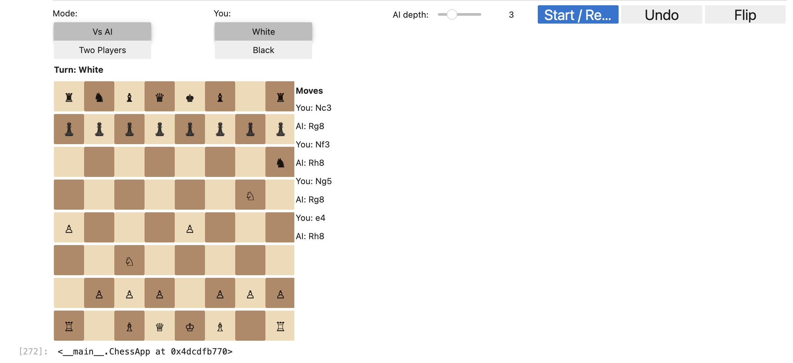

# Chess Position Evaluation using Machine Learning

This project trains a Convolutional Neural Network (CNN) to evaluate chess positions from FEN strings and predict their evaluation scores (in centipawns). The trained model is integrated with a chess application to provide real-time position assessments.

---

## Overview

The goal of this project is to replace the handcrafted evaluation functions of traditional chess engines with a neural network that learns to predict position strength directly from the board state.

- **Input:** Chess board state in FEN format
- **Output:** Evaluation score (normalized and in centipawns)
- **Evaluation Metric:** Mean Squared Error (MSE)
- **Framework:** TensorFlow / Keras
- **Goal:** Save the trained model and use it to evaluate positions within a chess-playing application

## Dataset

**Source:** [Chess Evaluations Dataset (Kaggle)](https://www.kaggle.com/datasets/ronakbadhe/chess-evaluations)  
Each record contains:

- A **FEN string** representing a chess position
- A **numerical evaluation score** (in centipawns)

---

## Data Preprocessing

1. Downloaded the dataset via `kagglehub`
2. Detects **FEN** and **evaluation** columns from the dataset
3. Converted FEN to an **8×8×14 tensor** representation
4. Filters out invalid and non-numeric scores (e.g., “M#”, “#3”).
5. Normalized evaluation scores to the range `[-1, 1]`
6. Clips outliers at ±3000 centipawns to stabilize training.
7. Removes duplicates and randomly samples up to 1M rows for efficiency.

---

## Dataset Balancing

To avoid bias toward common score ranges:

- Data is binned across normalized evaluation ranges.
- Inverse-frequency sample weights are computed to balance representation.
- Each sample’s contribution to training is adjusted using these weights.

---

## Train/Test Split

- Converts each FEN string into a structured (8×8×14) tensor representation.
- Splits data into training (80%) and test (20%) sets using stratification by bins.
- Sample weights are preserved during splitting.

---

## Neural Network Architecture

A CNN model is built using Keras with LeakyReLU, BatchNormalization, and Dropout for stability and generalization.

Model structure:

- Input: (8, 8, 14)
- Conv Block 1: 64 filters, (3×3), MaxPooling, Dropout
- Conv Block 2: 128 filters, (3×3), MaxPooling, Dropout
- Conv Block 3: 256 filters, (3×3), Dropout
- Dense Layers: 256 → 128 → 1 output neuron with tanh activation

  ```bash
  Optimizer: AdamW (lr=3e-4, weight_decay=1e-6)
  Loss Function: MSE
  Metric: MSE and RMSE (converted to centipawns)
  ```

---

## Model Training

Epochs: 200.  
Batch Size: 256.
Callbacks:

- EarlyStopping (patience=25)
- ReduceLROnPlateau (factor=0.7, patience=6)
- The model converged with:
  - Test MSE (normalized): 0.030114
  - Test RMSE (centipawns): 520.60

---

## Evaluation

- The final model achieves an RMSE of approximately 520 centipawns, which indicates reasonable accuracy for a learned evaluation model.
- Training and validation loss curves were visualized to verify convergence.
- Learning rate schedule plotted to confirm adaptive decay behavior.

## Results Summary

| Metric                 | Value      |
| ---------------------- | ---------- |
| Test MSE (normalized)  | 0.030114   |
| Test RMSE (centipawns) | 520.60     |
| Max Samples            | 1,000,000  |
| Input Shape            | (8, 8, 14) |

## Chess Application Interface

The trained model is integrated into a playable chess app that supports human vs AI gameplay with adjustable difficulty.

### Example Interface



## Files

- `chess_minimax_ml.ipynb` — Main notebook for preprocessing, training, and evaluation
- `ml_chess_eval.keras` — Trained model file
- `README.md` — Project documentation
